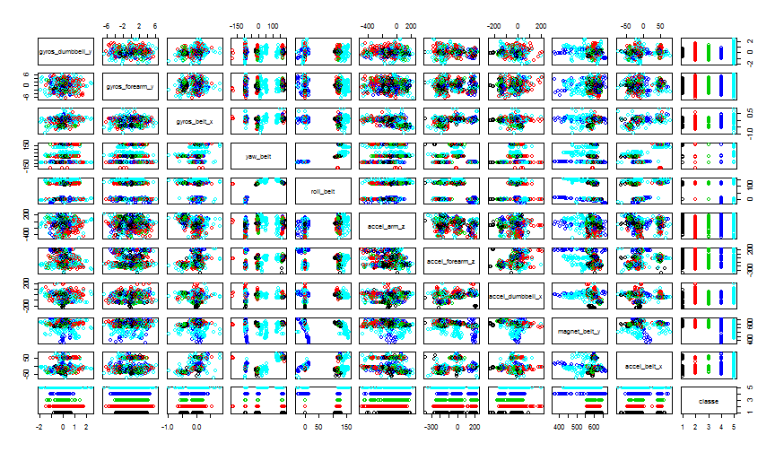

# Introduction

The goal of this assignment is to predict the manner people perform barbell lifts. We will use data from accelerometers on the belt, forearm, arm, and dumbell of 6 participants who were asked to perform this activity correctly and incorrectly. The outcome is recorded in the *classe* variable of the data set.

The training data will be use to train and validate the model and the test data to answer the second part of the assignement which consist of doing prediction on 20 samples.

* Training: https://d396qusza40orc.cloudfront.net/predmachlearn/pml-training.csv
* Testing: https://d396qusza40orc.cloudfront.net/predmachlearn/pml-testing.csv

Thanks to:
Ugulino, W.; Cardador, D.; Vega, K.; Velloso, E.; Milidiu, R.; Fuks, H. Wearable Computing: Accelerometers' Data Classification of Body Postures and Movements. Proceedings of 21st Brazilian Symposium on Artificial Intelligence. Advances in Artificial Intelligence - SBIA 2012. In: Lecture Notes in Computer Science. , pp. 52-61. Curitiba, PR: Springer Berlin / Heidelberg, 2012. ISBN 978-3-642-34458-9. DOI: 10.1007/978-3-642-34459-6_6. 

Read more: http://groupware.les.inf.puc-rio.br/har#sbia_paper_section#ixzz3OXdW9y00

We will start by loading the required libraries.

```r
suppressMessages(library(plyr))
suppressMessages(library(dplyr))
suppressMessages(library(knitr))
suppressMessages(library(ggplot2))
suppressMessages(library(caret))
# Set seed for reproducibility
set.seed(32343)
```

# Reading and cleaning the data

 We will first load the training data, and transform strings *NA*, *#DIV/0!* and empty string by NAs.


```r
## Take care of #DIV/0! and NA when reading data
data <- read.csv("pml-training.csv", na.strings=c("NA", "#DIV/0!", ""), header=TRUE)
```

 We will then suppress useless variables: *row numbers*, *user names* and variables with *timestamp* as these should not be related to the outcome.
 
 From a quick explorations of the data we see that:
 
 * *new_window* and *num_window* seem to be related to some summarization variables
 * a lot of variables are full of NAs and are related with the preceding finding
 
 We decide to remove the two *window* variables and also the ones with more then 90% NAs.
 

```r
## Suppress row numbers, user_name and timestamps because they should be uncorrelated to the outcome
data <- select(data, -X, -user_name, -contains("timestamp"))

str(data[data$new_window=="no",1:20])
```

```
## 'data.frame':	19216 obs. of  20 variables:
##  $ new_window          : Factor w/ 2 levels "no","yes": 1 1 1 1 1 1 1 1 1 1 ...
##  $ num_window          : int  11 11 11 12 12 12 12 12 12 12 ...
##  $ roll_belt           : num  1.41 1.41 1.42 1.48 1.48 1.45 1.42 1.42 1.43 1.45 ...
##  $ pitch_belt          : num  8.07 8.07 8.07 8.05 8.07 8.06 8.09 8.13 8.16 8.17 ...
##  $ yaw_belt            : num  -94.4 -94.4 -94.4 -94.4 -94.4 -94.4 -94.4 -94.4 -94.4 -94.4 ...
##  $ total_accel_belt    : int  3 3 3 3 3 3 3 3 3 3 ...
##  $ kurtosis_roll_belt  : num  NA NA NA NA NA NA NA NA NA NA ...
##  $ kurtosis_picth_belt : num  NA NA NA NA NA NA NA NA NA NA ...
##  $ kurtosis_yaw_belt   : logi  NA NA NA NA NA NA ...
##  $ skewness_roll_belt  : num  NA NA NA NA NA NA NA NA NA NA ...
##  $ skewness_roll_belt.1: num  NA NA NA NA NA NA NA NA NA NA ...
##  $ skewness_yaw_belt   : logi  NA NA NA NA NA NA ...
##  $ max_roll_belt       : num  NA NA NA NA NA NA NA NA NA NA ...
##  $ max_picth_belt      : int  NA NA NA NA NA NA NA NA NA NA ...
##  $ max_yaw_belt        : num  NA NA NA NA NA NA NA NA NA NA ...
##  $ min_roll_belt       : num  NA NA NA NA NA NA NA NA NA NA ...
##  $ min_pitch_belt      : int  NA NA NA NA NA NA NA NA NA NA ...
##  $ min_yaw_belt        : num  NA NA NA NA NA NA NA NA NA NA ...
##  $ amplitude_roll_belt : num  NA NA NA NA NA NA NA NA NA NA ...
##  $ amplitude_pitch_belt: int  NA NA NA NA NA NA NA NA NA NA ...
```

```r
str(data[data$new_window=="yes",1:20])
```

```
## 'data.frame':	406 obs. of  20 variables:
##  $ new_window          : Factor w/ 2 levels "no","yes": 2 2 2 2 2 2 2 2 2 2 ...
##  $ num_window          : int  12 13 14 18 47 48 51 55 57 58 ...
##  $ roll_belt           : num  1.51 1.27 1.18 1.01 129 128 124 125 124 123 ...
##  $ pitch_belt          : num  8.1 7.56 7.26 7.38 27.9 27.8 27.6 26 25.5 26.3 ...
##  $ yaw_belt            : num  -94.4 -94.1 -94.1 -93.8 2.35 1.52 -2.03 -2.08 -2.12 -3.45 ...
##  $ total_accel_belt    : int  3 3 3 4 21 21 20 20 20 20 ...
##  $ kurtosis_roll_belt  : num  5.588 -0.997 7.515 -2.121 -1.122 ...
##  $ kurtosis_picth_belt : num  NA NA NA -1.3 19.8 ...
##  $ kurtosis_yaw_belt   : logi  NA NA NA NA NA NA ...
##  $ skewness_roll_belt  : num  2.71315 0.00752 -3.03153 1.04401 -0.17785 ...
##  $ skewness_roll_belt.1: num  NA NA NA 0.881 -4.575 ...
##  $ skewness_yaw_belt   : logi  NA NA NA NA NA NA ...
##  $ max_roll_belt       : num  -94.3 -94.1 -94.1 -93.8 2.4 2.7 1.2 -0.7 -1.5 -2.1 ...
##  $ max_picth_belt      : int  3 3 3 4 21 21 21 20 20 20 ...
##  $ max_yaw_belt        : num  5.6 -1 7.5 -2.1 -1.1 -0.7 -0.7 -1.4 -0.5 -1.4 ...
##  $ min_roll_belt       : num  -94.4 -94.4 -94.2 -93.8 0.8 1.5 -2 -2.1 -3 -4.2 ...
##  $ min_pitch_belt      : int  3 3 3 3 20 20 20 19 19 18 ...
##  $ min_yaw_belt        : num  5.6 -1 7.5 -2.1 -1.1 -0.7 -0.7 -1.4 -0.5 -1.4 ...
##  $ amplitude_roll_belt : num  0.1 0.3 0.1 0 1.59 1.17 3.23 1.34 1.48 2.18 ...
##  $ amplitude_pitch_belt: int  0 0 0 1 1 1 1 1 1 2 ...
```

```r
## Suppress *window* variable
#data <- select(data, -contains("window"))

## Remove columns with NA > 90% total
NaIndex<-(colSums(is.na(data)) < 0.9*nrow(data))
data<-data[,NaIndex]
dim(data)
```

```
## [1] 19622    55
```
Here is a plot of the 1000 random samples of 10 random variables names and the outcome.


```r
# Take 1000 samples
l<-dim(data)[1]
i<-sample(x=1:(l), size = 1000)
# Take 10 variables
w<-dim(data)[2]
j<-sample(x=1:(w), size = 10)
# Add classe variable for plot
s<-cbind(data[i,c(j,55)])
pal<-palette()
c<-pal[as.numeric(s$classe)]

pairs(s, col=c)
```

 


# Machine learning algorithm

We divide the training data in a train partition and a validation partition and define the trainControl method to be "cv".


```r
## Create partition
inTrain = createDataPartition(data$classe, p = 3/4)[[1]]
training = data[ inTrain,]
validation = data[-inTrain,]

tCtrl<-trainControl(method = "cv")
```
We have tried multiple training algorithms: rpart, pca, glm and finaly opted for random forest as it is the one with the best results. As we've reduced the dimensions of the problem from 155 to 53 variables the time required to train the model on a HP EliteBook 8560p is less than one hour.
To save computation time for the writing, we've decided to save the model on disk and reload it if required instead of recomputing it.


```r
modelFilename<-"rf-model.RData"
if (file.exists(modelFilename)) {
        load(file = modelFilename)
        } else {
                ## Time is 3234 sec
                modelFit1<-train(training$classe ~ .,
                                 method="rf",
                                 preProcess = c("center", "scale"),
                                 data=training,
                                 trainControl = tCtrl)
                save(modelFit1, file=modelFilename)
                }
```

The confusion matrix is shown in the next section.
Here are the other learning algorithms applied but not used eventhough we could have used them in an "ensemble" implementation.


```r
modelFit <- train(training$classe ~ ., data=training, 
                  method="rpart",
                  preProcess = c("center", "scale"),
                  trainControl = tCtrl)

confusionMatrix(validation$classe, predict(modelFit,newdata=validation))
```


```r
train2<-select(training, -classe)
preProc<-preProcess(train2, method="pca", thresh = 0.99)
trainPC<-predict(preProc, train2)
modelFit2<-train(training$classe ~ .,
                 method="rf",
                 data=trainPC)
test2<-select(validation, -classe)
testPC<-predict(preProc, test2)
confusionMatrix(validation$classe, predict(modelFit2,testPC))
```


```r
modelFit <- train(classe ~ ., data=training, 
                  method="glm",
                  preProcess = c("center", "scale"))

predictions <- predict(modelFit,newdata=validation)
confusionMatrix(validation$classe, predictions)
```

# Cross validation


```r
predictions <- predict(modelFit1,newdata=validation)
confusionMatrix(validation$classe, predictions)
```

```
## Confusion Matrix and Statistics
## 
##           Reference
## Prediction    A    B    C    D    E
##          A 1395    0    0    0    0
##          B    8  939    1    1    0
##          C    0    0  855    0    0
##          D    0    0    2  802    0
##          E    0    0    0    2  899
## 
## Overall Statistics
##                                           
##                Accuracy : 0.9971          
##                  95% CI : (0.9952, 0.9984)
##     No Information Rate : 0.2861          
##     P-Value [Acc > NIR] : < 2.2e-16       
##                                           
##                   Kappa : 0.9964          
##  Mcnemar's Test P-Value : NA              
## 
## Statistics by Class:
## 
##                      Class: A Class: B Class: C Class: D Class: E
## Sensitivity            0.9943   1.0000   0.9965   0.9963   1.0000
## Specificity            1.0000   0.9975   1.0000   0.9995   0.9995
## Pos Pred Value         1.0000   0.9895   1.0000   0.9975   0.9978
## Neg Pred Value         0.9977   1.0000   0.9993   0.9993   1.0000
## Prevalence             0.2861   0.1915   0.1750   0.1642   0.1833
## Detection Rate         0.2845   0.1915   0.1743   0.1635   0.1833
## Detection Prevalence   0.2845   0.1935   0.1743   0.1639   0.1837
## Balanced Accuracy      0.9971   0.9987   0.9983   0.9979   0.9998
```

# Out of sample error

